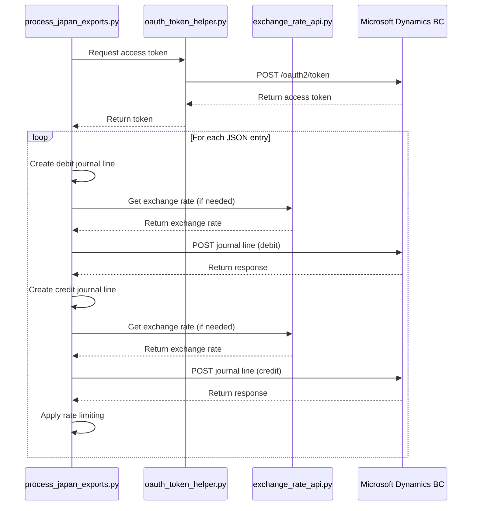

# Power-importer: ERP Integration System Design Document

## Introduction

This document outlines the design for a system that processes CSV files, with a particular focus on those originating from Japanese sources. The primary purpose of this project is to convert these CSV files into a structured JSON format. This structured data will then be integrated with a Microsoft Dynamics Business Central ERP system.

The core technologies leveraged in this project include Python for data processing and transformation, and Microsoft Dynamics Business Central for the ERP integration.

## System Architecture

This section describes the components and their interactions within the CSV processing and ERP integration system.

### High-Level Diagram

```mermaid
graph TD
    %% Main Data Flow
    CSV[Incoming CSV Files<br>Various Encodings] --> CC[charset_converter.py]
    CC -->|UTF-8 CSV Files| CSVJSON[csv_to_json_converter.py]
    CSVJSON -->|Structured JSON| PJE[process_japan_exports.py]
    PJE -->|Authenticated API Calls| ERP[ERP System<br>Microsoft Dynamics BC]
    
    %% Authentication Flow
    OTH[oauth_token_helper.py] -->|OAuth Token| PJE
    
    %% Currency Conversion Flow
    ERA[exchange_rate_api.py] -->|Exchange Rates| PJE
    CCM[company_currency_mapping.py] -->|Currency Rules| ERA
    
    %% Subprocesses
    subgraph "charset_converter.py"
        CC1[Detect Encoding] --> CC2[Convert to UTF-8]
        CC2 --> CC3[Validate Conversion]
    end
    
    subgraph "csv_to_json_converter.py"
        CSV1[Fix Line Breaks] --> CSV2[Process Headers]
        CSV2 --> CSV3[Process Debit/Credit Pairs]
        CSV3 --> CSV4[Normalize Currency]
        CSV4 --> CSV5[Consolidate Entries]
    end
    
    subgraph "process_japan_exports.py"
        PJE1[Create Journal Lines] --> PJE2[Transform Currency]
        PJE2 --> PJE3[Post to API with Rate Limiting]
        PJE3 --> PJE4[Generate Reports]
        PJE5[Verify Balanced Amounts] --> PJE3
    end
    
    subgraph "oauth_token_helper.py"
        OTH1[Acquire Token] --> OTH2[Handle SSL Verification]
        OTH2 --> OTH3[Provide Authorization Header]
    end
    
    subgraph "exchange_rate_api.py"
        ERA1[Get Company Rates] --> ERA2[Find Rate]
        ERA2 --> ERA3[Calculate Cross-Rates]
        ERA4[Cache Exchange Rates] --> ERA1
    end
```



### Component Descriptions

#### `charset_converter.py`
* **Responsibility**: Detects the character encoding of input CSV files (e.g., Shift-JIS, EUC-JP). Converts the files from their original encoding to UTF-8 to ensure compatibility and prevent data corruption during subsequent processing steps.
* **Key Functions**:
  * Detects file encoding using chardet with confidence scoring
  * Handles multiple encoding attempts if initial detection has low confidence
  * Validates conversion quality by checking for replacement characters
  * Supports Japanese text optimization with specialized encoding detection
  * Provides detailed logging of the conversion process

#### `csv_to_json_converter.py`
* **Responsibility**: Takes the UTF-8 encoded CSV files as input and converts them into a structured JSON format. This script handles the complex mapping of CSV columns (including a two-line header) to JSON fields, performs data normalization (e.g., currency codes), applies specific business logic for GL account and vendor processing, and truncates descriptions. The output is an intermediate JSON file.
* **Key Functions**:
  * Handles CSV files with line breaks in quoted fields
  * Processes two-line headers with Japanese characters
  * Pairs debit/credit entries
  * Normalizes currency values (e.g., "台湾ドル" to "NTD", "円" to "JPY")
  * Consolidates entries based on voucher_no and vendor_code
  * Applies business rules for account and department code processing
  * Truncates descriptions to 100 characters (later further truncated to 50 in process_japan_exports.py)

#### `process_japan_exports.py`
* **Responsibility**: This is the main ERP integration script. It takes the structured JSON file (generated by `csv_to_json_converter.py`) as input. It then transforms each JSON entry into two journal lines (debit and credit), authenticates with the ERP system (using `oauth_token_helper.py`), maps the JSON data to the ERP API payload structure, and posts the data to Microsoft Dynamics Business Central.
* **Key Functions**:
  * Creates journal line payloads for API from JSON entries
  * Transforms currency codes based on company rules
  * Implements rate limiting with exponential backoff for API calls
  * Verifies balanced amounts between debit and credit entries
  * Generates reports for unbalanced entries and currency modifications
  * Handles API errors with retry logic

#### `oauth_token_helper.py`
* **Responsibility**: Manages the acquisition and caching/refreshing of OAuth 2.0 access tokens required for authenticating API calls to the Microsoft Dynamics Business Central ERP system. This ensures secure communication.
* **Key Functions**:
  * Acquires OAuth tokens from Microsoft Azure AD
  * Manages SSL certificate validation (currently disabled for development)
  * Provides authorization headers for API requests
  * Handles token expiration and refresh

#### `exchange_rate_api.py`
* **Responsibility**: Manages currency exchange rate calculations and retrieval from the Business Central API.
* **Key Functions**:
  * Retrieves exchange rates from Business Central API
  * Caches rates to minimize API calls
  * Calculates cross-rates between currencies
  * Handles various currency code formats
  * Integrates with company_currency_mapping.py for currency rules

#### `company_currency_mapping.py`
* **Responsibility**: Provides mapping between company codes and their home currencies, and handles currency code normalization.
* **Key Functions**:
  * Defines company to home currency mappings
  * Normalizes currency codes
  * Provides functions to get all variants of a currency code

#### ERP System (Microsoft Dynamics Business Central)
* **Responsibility**: The target enterprise resource planning system. It receives the processed and structured JSON data, formatted as journal lines, from `process_japan_exports.py`. This data is then used to create general journal entries within the ERP.

## Sequence Diagram for API Authentication and Posting



## Detailed Data Flow

This section provides a higher-level overview of the sequential data transformation and integration process, emphasizing the role of each component.

### Step 1: Original CSV File Input
* The process starts with one or more CSV files. These files are typically exports from other financial systems and may have Japanese-specific character encodings (e.g., Shift-JIS, EUC-JP). They contain transactional data intended for import into the ERP.

### Step 2: Character Set Normalization (via `charset_converter.py`)
* **Purpose**: To standardize the character encoding to prevent data loss or corruption ("mojibake") and ensure compatibility with subsequent processing stages.
* **Process**:
  * `charset_converter.py` takes an input CSV file path and an output file path.
  * It uses the `chardet` library to detect the original encoding.
  * If confidence is low (<70%), it tries with more data or falls back to common encodings.
  * It then reads the file using the detected encoding and writes it out as a new CSV file encoded in UTF-8.
  * It validates the conversion by checking for replacement characters and other indicators of encoding issues.
* **Output**: A UTF-8 encoded version of the original CSV file. This file serves as the input for the next stage.

### Step 3: Conversion to Structured JSON (via `csv_to_json_converter.py`)
* **Purpose**: To transform the flat, tabular CSV data into a structured, hierarchical JSON format that accurately represents the financial transactions and incorporates necessary business logic and data cleaning.
* **Process**:
  * `csv_to_json_converter.py` takes the UTF-8 encoded CSV file as input.
  * It processes the specific two-line header structure of the CSV to correctly identify data columns.
  * It applies various data transformations, normalizations (e.g., currency codes, date formats), and specific business rules for account and department code processing.
  * It restructures the data from each CSV row into a defined JSON object structure, often creating distinct debit and credit objects within a parent JSON object.
  * It consolidates entries based on voucher_no and vendor_code to handle multiple debit entries with a single consolidated credit entry.
* **Output**: An intermediate JSON file containing an array of structured objects, where each object represents the data extracted and transformed from the CSV, ready for ERP integration.

### Step 4: ERP Integration - Posting Journal Lines (via `process_japan_exports.py`)
* **Purpose**: To take the structured JSON data, authenticate with Microsoft Dynamics Business Central, and post the data as general journal entries.
* **Process**:
  * `process_japan_exports.py` takes the intermediate JSON file (generated in Step 3) as input.
  * It reads and parses this JSON file.
  * For each entry in the JSON:
    * It uses `oauth_token_helper.py` to ensure a valid OAuth 2.0 access token is available for API communication.
    * It transforms the JSON entry into two separate journal line payloads (one for debit, one for credit) according to the specific field requirements of the ERP API.
    * It verifies that debit and credit amounts balance within a specified tolerance.
    * It dynamically constructs the API endpoint URL based on data within the JSON entry (specifically, the company code derived from the department).
    * It implements rate limiting with exponential backoff to prevent API throttling.
    * It makes two API calls per original JSON entry to post the debit and credit journal lines to the ERP.
    * It logs the outcome of each API call and handles errors appropriately.
* **Output**: Data is posted into Microsoft Dynamics Business Central as general journal entries. Log files are updated with the status of these operations.

## Data Validation Strategies

This section outlines the validation strategies implemented at each stage of the data processing pipeline to ensure data integrity and prevent errors.

### Validation in `charset_converter.py`
* **Encoding Detection Validation**:
  * Uses confidence scores from chardet to assess the reliability of encoding detection
  * If confidence is below 70%, attempts detection with more data or falls back to common encodings
* **Conversion Quality Validation**:
  * Counts replacement characters (�) which indicate conversion issues
  * Checks for encoding artifact characters
  * Calculates a problem percentage (replacement + artifact characters / total characters)
  * For Japanese encodings, verifies the presence of actual Japanese characters
  * Rejects conversions with more than 10% problematic characters unless forced

### Validation in `csv_to_json_converter.py`
* **CSV Structure Validation**:
  * Verifies the presence of the expected two-line header
  * Checks for minimum required columns
* **Data Type Validation**:
  * Attempts to convert numeric values (e.g., amounts) to float, handling conversion errors
* **Business Rule Validation**:
  * Validates department codes and skips entries with invalid codes (e.g., "VCJ.9999")
  * Ensures vendor codes are properly formatted
* **Consolidation Validation**:
  * When consolidating entries, verifies that all entries being consolidated have the same voucher_no and vendor_code
  * Ensures the consolidated amount correctly represents the sum of individual entries

### Validation in `process_japan_exports.py`
* **Balance Verification**:
  * Implements `verify_balanced_amounts` function to ensure debit and credit amounts balance
  * Applies a configurable tolerance (default 0.01) to account for rounding differences
  * Generates reports for unbalanced entries
* **API Response Validation**:
  * Checks HTTP status codes from API responses
  * Handles 429 (Too Many Requests) with rate limiting and backoff
  * For 5xx errors, implements retry logic
  * For other errors, logs detailed error information
* **Field Length Validation**:
  * Truncates fields that exceed API limits (e.g., description to 50 characters, account_no to 100 characters)
  * Logs warnings when truncation occurs

### Validation in `exchange_rate_api.py`
* **Exchange Rate Validation**:
  * Verifies that retrieved rates are positive numbers
  * Handles missing rates by raising appropriate exceptions
  * Validates date formats for rate queries

## Rate Limiting Implementation

The system implements a sophisticated rate limiting mechanism in `process_japan_exports.py` to prevent API throttling and ensure reliable operation.

### RateLimiter Class
* **Purpose**: Manages API call timing and implements exponential backoff for failed requests
* **Key Parameters**:
  * `base_delay`: Base delay in seconds between API calls (default: 5.0)
  * `max_delay`: Maximum delay in seconds (default: 10.0)
  * `backoff_factor`: Factor to increase delay on failures (default: 2.0)
* **Key Methods**:
  * `wait_before_request()`: Enforces appropriate waiting time before making a request
  * `record_success()`: Resets consecutive failure count after successful request
  * `record_failure()`: Increments failure count and logs the failure

### Exponential Backoff Strategy
* **Initial Delay**: Starts with the base_delay (e.g., 5 seconds)
* **After Failures**: Delay increases exponentially: base_delay * (backoff_factor ^ (consecutive_failures - 1))
* **Maximum Delay**: Caps at max_delay to prevent excessive waiting
* **Retry Logic**: Implements up to max_retries (default: 3) attempts for failed API calls

### Rate Limiting in Action
1. Before each API call, the system calls `wait_before_request()`
2. If the call succeeds, `record_success()` is called
3. If the call fails, `record_failure()` is called and the delay increases
4. For 429 responses (Too Many Requests), the system automatically backs off
5. For 5xx responses, the system retries with increased delays

This approach ensures the system respects API rate limits while maximizing throughput and reliability.

## Exchange Rate Handling

The `exchange_rate_api.py` module provides comprehensive currency conversion capabilities, which are critical for accurate financial data processing.

### Exchange Rate Retrieval
* **Source**: Rates are retrieved from the Business Central API
* **Caching Strategy**:
  * Rates are cached in memory using a dictionary with keys based on company, currency, and date
  * This minimizes API calls for repeated conversions
* **Date Handling**:
  * Supports specific date queries or defaults to current date
  * Option to use month-start dates for consistent monthly rates

### Currency Code Handling
* **Normalization**:
  * Works with `company_currency_mapping.py` to normalize currency codes
  * Handles various formats (e.g., with or without "R-" prefix)
* **Company-Specific Rules**:
  * Each company has a defined "home" currency
  * Special rules apply for conversions involving home currencies
* **Overseas Vendor Handling**:
  * For overseas vendors (vendor codes starting with V-VC), original currency and amount are preserved without conversion
  * Special case: For VCT company with NTD currency (home currency), currency code is set to empty string
  * For overseas vendors with non-home currencies, standard currency code transformation rules are applied (e.g., adding "R-" prefix)

### Conversion Types
* **Direct Conversion**:
  * Foreign currency to home currency (e.g., USD to NTD for VCT)
  * Home currency to foreign currency (e.g., JPY to USD for VCJ)
* **Cross-Currency Conversion**:
  * Between two foreign currencies (e.g., USD to EUR)
  * Uses home currency as an intermediate step

### Calculation Methods
* **Simple Conversion**: Uses direct exchange rate when available
* **Cross-Rate Calculation**:
  * For currency pairs without direct rates
  * Formula: (from_value / from_amount) / (to_value / to_amount)
* **Rate Fallback**:
  * If specific date rate not found, uses most recent prior rate
  * If company-specific rate not found, attempts to find rate in another company

## Consolidated Entries Logic

The system implements a sophisticated mechanism for consolidating multiple entries, particularly in `csv_to_json_converter.py`.

### Consolidation Criteria
* Entries are consolidated based on:
  * Same voucher_no (伝票No.)
  * Same vendor_code (支払先CD)

### Consolidation Process
1. **Grouping**: Entries are first grouped by voucher_no, then by vendor_code
2. **Debit Preservation**: All debit entries are preserved as individual entries
3. **Credit Consolidation**: For each group:
   * A single consolidated credit entry is created
   * The amount is the sum of all debit amounts in the group
   * The consolidated entry is marked with `"consolidated": true`
   * A count of original entries is stored in `original_entries_count`

### Special Cases
* **Already Consolidated Entries**: If the input JSON already contains consolidated entries (marked with `"consolidated": true`), the system respects this and doesn't re-consolidate
* **Single Entry Groups**: Groups with only one entry are not consolidated
* **Missing Vendor Code**: Entries without a vendor_code are processed individually

### Balance Verification for Consolidated Entries
* The `verify_balanced_amounts` function in `process_japan_exports.py` handles both:
  * Individual entries (debit and credit from same entry)
  * Consolidated groups (multiple debit entries with one consolidated credit)
* A tolerance parameter (default: 0.01) accounts for rounding differences

### Reporting
* Unbalanced entries (including consolidated groups) are reported in `unbalanced_entries_report.md`
* The report includes voucher_no, vendor_code, debit_total, credit_total, and difference

## Configuration Management

This section details how system configurations, especially sensitive data, are managed.

### `.env` Files for Local Configuration
* Sensitive information such as API keys, client secrets, and specific URLs for the ERP system are stored in `.env` files.
* Each developer or deployment environment should have its own `.env` file. This file is placed in the root directory of the project.
* **Security**: The `.env` file is listed in the `.gitignore` file to prevent it from being committed to the version control system (Git). This is crucial for protecting sensitive credentials from being exposed in the codebase.
* An example file, `.env.example`, is included in the repository. This file lists all the necessary environment variables that the application expects, but with placeholder or empty values.

### `env_config.py` for Loading Configuration
* The `env_config.py` script is responsible for loading the environment variables from the `.env` file into the application's runtime environment.
* It provides the `get_env_var` function which supports:
  * Default values
  * Required flag to raise errors for missing critical variables
  * Type conversion (e.g., string to boolean)

### Key Environment Variables
* `ERP_CLIENT_ID`: The client ID for the application registered in Azure Active Directory
* `ERP_CLIENT_SECRET`: The client secret for the application
* `ERP_TOKEN_URL`: The URL of the OAuth 2.0 token endpoint
* `ERP_API_URL`: The base URL for the Microsoft Dynamics Business Central API
* `ERP_SCOPE`: The scope(s) required for accessing the ERP API

## Authentication and Authorization

This section describes the mechanisms used to authenticate with the Microsoft Dynamics Business Central ERP system and authorize API requests.

### OAuth 2.0 Client Credentials Grant Flow
* The system utilizes the OAuth 2.0 client credentials grant flow for server-to-server authentication with the Microsoft Dynamics Business Central API.
* **Process (handled by `oauth_token_helper.py` and utilized by `process_japan_exports.py`):**
  1. The application sends a POST request to the ERP's token endpoint (defined by `ERP_TOKEN_URL`).
  2. This request includes:
     * `grant_type`: Set to `client_credentials`.
     * `client_id`: The application's `ERP_CLIENT_ID`.
     * `client_secret`: The application's `ERP_CLIENT_SECRET`.
     * `scope`: The `ERP_SCOPE` defining the requested permissions.
  3. If the credentials are valid, the token endpoint returns a JSON response containing an `access_token` and its `expires_in` time.

### Role of `oauth_token_helper.py`
* The `oauth_token_helper.py` script encapsulates the token acquisition and management process.
* **Token Acquisition**: It constructs and sends the token request as described above.
* **Token Caching**: Upon receiving a new access token, the helper caches it along with its expiry time.
* **Token Usage**: When `process_japan_exports.py` needs to make an API call, it requests a valid token.
* **Authorization Header**: The obtained access token is included in the `Authorization` header of API requests.

### SSL Certificate Verification
* **Current Implementation**: SSL certificate verification is currently disabled (`verify=False`) for development.
* **Security Implication**: This is a significant security risk for production environments.
* **Recommendation**: Enable SSL verification (`verify=True`) in production and test environments.

## Error Handling and Logging

This section outlines the strategies for handling errors and logging activities within the system.

### General Error Handling Strategy
* **Try-Except Blocks**: Core logic in all scripts is enclosed in `try-except` blocks to catch potential exceptions gracefully.
* **Specific Exceptions**: Scripts aim to catch specific exceptions rather than generic `Exception` where possible.
* **Fail Fast/Graceful Degradation**: For critical errors, scripts generally "fail fast" by logging the error and exiting. For non-critical errors affecting single records, the script may log the error and continue with the next record.

### Error Handling in Specific Scripts
* **`charset_converter.py`**:
  * Handles `FileNotFoundError` if the input CSV file does not exist.
  * Handles potential `chardet` errors or low-confidence detection, logging a warning.
  * Catches `IOError` or `OSError` during file operations.

* **`csv_to_json_converter.py`**:
  * Handles `FileNotFoundError` for the input UTF-8 CSV.
  * Catches `csv.Error` for malformed CSVs or unexpected header structures.
  * Handles `ValueError` or `KeyError` during data conversion/mapping for individual rows.

* **`process_japan_exports.py`**:
  * Implements retry logic for API calls with exponential backoff
  * Handles different HTTP status codes appropriately (4xx vs 5xx)
  * Generates detailed error reports for failed operations

### Logging Mechanisms
* **Console Output**: Provides immediate feedback, typically logging INFO level and above.
* **File-based Logging**:
  * **`erp_api_integration.log`**: For `process_japan_exports.py` and `oauth_token_helper.py` events.
  * **`csv_conversion.log`**: For `charset_converter.py` and `csv_to_json_converter.py` events.
* **Log Format**: Includes timestamp, log level, script/logger name, function name, and the message.
* **Log Levels**: Standard levels (DEBUG, INFO, WARNING, ERROR, CRITICAL) are used.

## Error Recovery Procedures

This section outlines procedures for recovering from common failure scenarios.

### Failed API Calls
1. **Check Logs**: Review `erp_api_integration.log` for specific error messages
2. **Token Issues**: If authentication failed, verify ERP_CLIENT_ID and ERP_CLIENT_SECRET in .env
3. **Rate Limiting**: If encountering 429 errors, adjust rate limiting parameters (increase base_delay)
4. **Data Issues**: For 400 errors, check the JSON data for format issues
5. **Recovery Process**:
   * Fix the identified issue
   * Re-run `process_japan_exports.py` with the same JSON file
   * The script will attempt to post all entries, including previously failed ones

### Encoding Detection Failures
1. **Check Logs**: Review `csv_conversion.log` for encoding detection details
2. **Manual Specification**: If automatic detection fails, specify encoding manually:
   ```
   python charset_converter.py input.csv output_utf8.csv --encoding shift_jis
   ```
3. **Force Conversion**: For problematic files, use the --force flag:
   ```
   python charset_converter.py input.csv output_utf8.csv --encoding shift_jis --force
   ```

### CSV Parsing Errors
1. **Line Break Issues**: If CSV has line breaks in fields, ensure --fix-line-breaks is enabled
2. **Header Structure**: Verify the CSV has the expected two-line header
3. **Manual Inspection**: Open the CSV in a text editor to check for structural issues
4. **Recovery Process**:
   * Fix the CSV structure issues
   * Re-run the conversion pipeline from the beginning

### Unbalanced Entries
1. **Review Report**: Check the generated `unbalanced_entries_report.md`
2. **Tolerance Adjustment**: If differences are small, consider increasing balance_tolerance:
   ```
   python process_japan_exports.py data.json --balance-tolerance 0.05
   ```
3. **Skip Option**: To proceed despite unbalanced entries:
   ```
   python process_japan_exports.py data.json --skip-unbalanced
   ```

## Monitoring and Alerting

While not currently implemented, the following monitoring and alerting strategies are recommended:

### Log-Based Monitoring
* Implement log parsing to detect ERROR and CRITICAL level messages
* Set up alerts for:
  * High rate of API failures
  * Authentication failures
  * Unbalanced entries exceeding a threshold

### Performance Monitoring
* Track processing time per file and per record
* Monitor API response times
* Alert on significant deviations from baseline performance

### File System Monitoring
* Monitor disk space for log and intermediate file storage
* Track growth rate of log files
* Alert when approaching storage limits

### Integration Health Checks
* Implement periodic health check that verifies:
  * API connectivity
  * Authentication system
  * File system access
  * Exchange rate retrieval

## Key Scripts and Their Usage

This section provides an overview of the main Python scripts, their command-line usage, and expected inputs/outputs.

### 1. `charset_converter.py`
* **Purpose**: Detects and converts the character encoding of input CSV files to UTF-8.
* **Command-line Arguments**:
  * `input_file_path`: Path to the source CSV file.
  * `output_file_path`: Path where the UTF-8 encoded CSV file will be saved.
  * (Optional) `--encoding <encoding>`: Manually specify the source encoding.
  * (Optional) `--force`: Force conversion even if validation fails.
  * (Optional) `--japanese`: Optimize for Japanese text detection.
* **Example Usage**:
  ```bash
  python charset_converter.py "input/Evelyn Raku export.csv" "output/Evelyn Raku export_utf8.csv"
  ```

### 2. `csv_to_json_converter.py`
* **Purpose**: Converts a UTF-8 encoded CSV file into a structured JSON file.
* **Command-line Arguments**:
  * `-i, --input`: Path to the input UTF-8 encoded CSV file.
  * `-o, --output`: Path where the output JSON file will be saved.
  * (Optional) `--max-desc-length`: Maximum length for description field (default: 100).
  * (Optional) `--no-fix-line-breaks`: Disable fixing line breaks in CSV fields.
  * (Optional) `--line-break-replacement`: Character to replace line breaks with (default: space).
* **Example Usage**:
  ```bash
  python csv_to_json_converter.py -i "output/Evelyn Raku export_utf8.csv" -o "output/Evelyn Raku export.json"
  ```

### 3. `process_japan_exports.py`
* **Purpose**: Reads the structured JSON data and posts it to Microsoft Dynamics Business Central.
* **Command-line Arguments**:
  * `input_file`: Path to the input JSON file.
  * (Optional) `--report`: Generate currency modification report to specified file path.
  * (Optional) `--unbalanced-report`: Generate unbalanced entries report to specified file path.
  * (Optional) `--balance-tolerance`: Acceptable difference between debit and credit amounts.
  * (Optional) `--skip-unbalanced`: Skip unbalanced entries instead of posting them.
  * (Optional) `--dry-run`: Generate report only without posting to API.
  * (Optional) `--base-delay`, `--max-delay`, `--backoff-factor`: Rate limiting parameters.
  * (Optional) `--max-retries`: Maximum number of retry attempts for failed API calls.
* **Example Usage**:
  ```bash
  python process_japan_exports.py "output/Evelyn Raku export.json"
  ```

## Business Requirements for Raw Data to API Payload Conversion

This section details the step-by-step business logic and data transformations applied from the initial raw CSV data to the final JSON payload sent to the ERP system's API.

### 1. CSV Data Ingestion and Initial JSON Structuring (from `csv_to_json_converter.py`)

#### 1.1. CSV Input and Encoding
* **Expected Encoding**: The script expects the input CSV file to be UTF-8 encoded.

#### 1.2. Header Processing
* **Two-Line Header**: The script processes CSV files with a two-line header.
  * The first line contains general headers.
  * The second line contains more specific (often Japanese) headers.

#### 1.3. Data Mapping and Transformation
* **Pairing of Debit/Credit Rows**: The script processes each row to extract both debit and credit side information.
* **Core CSV Column to JSON Field Mapping**:
  * `voucher_no`: Mapped from "伝票No." (Voucher No.).
  * `transaction_date`: Mapped from "仕訳日" (Journal Date).
  * `debit.gl_account`: Mapped from "G/L Account" or "Vendor".
  * `debit.account`: Mapped based on GL account type.
  * `debit.amount`: Mapped from "換算前額" (Amount before conversion).
  * `debit.currency`: Mapped from "単位" (Unit/Currency).
  * `credit.gl_account`: Mapped from "G/L Account" or "Vendor".
  * `credit.account`: Mapped based on GL account type.
  * `credit.amount`: Mapped from "換算前額" (Amount before conversion).
  * `credit.currency`: Mapped from "単位" (Unit/Currency).

* **Currency Normalization**:
  * "台湾ドル" is converted to "NTD".
  * "円" is converted to "JPY".

* **Description Truncation**:
  * Descriptions are truncated to a maximum of 100 characters.

#### 1.4. GL Account and Vendor Processing Logic
* **For Vendor accounts**:
  * `account`: Set to vendor_code
  * `department_code`: Transformed to format "XXX.9999"

* **For G/L Account accounts**:
  * `account`: Determined by priority order of sub_account, main_account, payment_destination_code
  * `department_code`: Uses original department code

### 2. API Payload Generation (from `process_japan_exports.py`)

#### 2.1. Journal Line Generation
* For each entry
