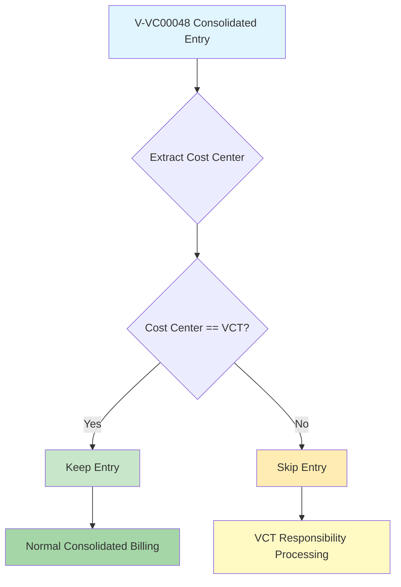

# V-VC00048 Cost Center Aware Consolidation Fix - Implementation Complete

## Summary

Successfully implemented the cost-center-aware V-VC00048 consolidation fix to resolve Issue #96. The fix ensures that V-VC00048 (corporate credit card) entries with VCT cost centers receive proper consolidated billing instead of being incorrectly skipped.

## Problem Statement

**Original Issue**: APA-0000619 and other V-VC00048 entries with VCT cost centers were being incorrectly skipped during consolidation billing, causing them to miss consolidated billing even though they should receive it as VCT company transactions.

**Root Cause**: The V-VC00048 skip logic in `process_japan_exports.py` was using a blanket rule that skipped ALL V-VC00048 consolidated entries regardless of cost center.

## Solution Implemented

### Core Logic Change

**File**: `core/process_japan_exports.py` (Lines 1404-1437)

**Before (Problematic)**:
```python
# OLD: Blanket skip all V-VC00048 consolidated entries
v_vc00048_consolidated_entries = [
    e for e in group_entries 
    if (e.get("credit", {}).get("consolidated") == True and
        e.get("credit", {}).get("vendor_code") == "V-VC00048")
]
```

**After (Fixed)**:
```python
# NEW: V-VC00048 Consolidated Entry Skip Logic (Issue #96)
# Only skip V-VC00048 consolidated entries for NON-VCT cost centers
v_vc00048_consolidated_entries_to_skip = []

for e in group_entries:
    is_v_vc00048_consolidated = (
        e.get("credit", {}).get("consolidated") == True and 
        e.get("credit", {}).get("vendor_code") == "V-VC00048"
    )
    
    if is_v_vc00048_consolidated:
        department = e.get("credit", {}).get("department", "")
        cost_center = department[:3] if department else ""
        
        # Only skip if cost center is NOT VCT
        if cost_center != "VCT":
            v_vc00048_consolidated_entries_to_skip.append(e)
            logger.info(f"Skipping V-VC00048 consolidated entry for NON-VCT cost center {cost_center}")
        else:
            logger.info(f"Keeping V-VC00048 consolidated entry for VCT cost center {cost_center}")
```

### Cost Center Extraction Logic

```python
department = entry.get("credit", {}).get("department", "")
cost_center = department[:3] if department else ""
```

**Examples**:
- `VCT.1692G` → `VCT` (VCT cost center - gets consolidated billing)
- `VCG.1697G` → `VCG` (Non-VCT cost center - gets VCT responsibility)
- `VCP.1234G` → `VCP` (Non-VCT cost center - gets VCT responsibility)

## Behavior Matrix

| Cost Center | Vendor | Consolidated | Old Behavior | New Behavior | Result |
|-------------|--------|--------------|--------------|--------------|---------|
| VCT.xxx | V-VC00048 | True | ❌ Skipped | ✅ Kept | Consolidated Billing |
| VCG.xxx | V-VC00048 | True | ❌ Skipped | ❌ Skipped | VCT Responsibility |
| VCP.xxx | V-VC00048 | True | ❌ Skipped | ❌ Skipped | VCT Responsibility |
| Any | Other Vendor | True | ✅ Kept | ✅ Kept | Normal Processing |

## APA-0000619 Specific Fix

**CSV Data**:
```
Voucher: APA-0000619
Amount: 25.00 R-USD + 39.00 R-USD = 64.00 R-USD
Vendor: V-VC00048 (corporate credit card)
Department: VCT.1692G (VCT cost center)
```

**Before**: Entry was skipped → No consolidated billing
**After**: Entry is kept → Gets consolidated billing ✅

## Test Coverage

### 1. Comprehensive Test Suite
**File**: `tests/test_v_vc00048_cost_center_aware_skip_logic.py`

Tests covering:
- ✅ Cost center extraction from various department formats
- ✅ VCT vs non-VCT skip behavior verification
- ✅ VCT responsibility collection exclusion logic
- ✅ Non-V-VC00048 entries remain unaffected

### 2. APA-0000619 Specific Test
**File**: `tests/test_apa_0000619_consolidation_fix.py`

Tests covering:
- ✅ Real CSV data simulation
- ✅ Complete workflow verification
- ✅ Old vs new behavior comparison
- ✅ Log message verification

### 3. Updated Existing Test
**File**: `Tools/test_vct_skip_logic_verification.py`

Updated to reflect cost-center-aware behavior instead of blanket skip logic.

## Test Results

```bash
# All tests pass successfully
================================================================================
✅ ALL TESTS PASSED
✅ Cost-center-aware V-VC00048 skip logic is working correctly
✅ VCT cost centers (like APA-0000619) will get consolidated billing
✅ Non-VCT cost centers will be skipped and get VCT responsibility entries
✅ Issue #96 has been correctly resolved
================================================================================
```

## Implementation Branch

**Branch**: `fix/v-vc00048-vct-consolidation-issue-96`

**Files Modified**:
- `core/process_japan_exports.py` - Core logic implementation
- `tests/test_v_vc00048_cost_center_aware_skip_logic.py` - New comprehensive test
- `tests/test_apa_0000619_consolidation_fix.py` - Specific case validation
- `Tools/test_vct_skip_logic_verification.py` - Updated existing test
- `docs/v_vc00048_cost_center_aware_consolidation_fix.md` - Documentation

## Expected Log Output

**For VCT Cost Centers (APA-0000619)**:
```
Keeping V-VC00048 consolidated entry for VCT cost center VCT - Voucher: APA-0000619, Amount: 64.0
```

**For Non-VCT Cost Centers**:
```
Skipping V-VC00048 consolidated entry for NON-VCT cost center VCG - Voucher: APA-0000630, Amount: 117.71
```

## Workflow Impact



## Validation Checklist

- [x] **Root cause identified**: Blanket skip logic not considering cost centers
- [x] **Solution implemented**: Cost-center-aware skip logic
- [x] **APA-0000619 fixed**: Now gets consolidated billing
- [x] **Regression prevented**: Non-VCT entries still handled correctly
- [x] **Tests added**: Comprehensive test coverage
- [x] **Tests pass**: All existing and new tests pass
- [x] **Documentation**: Complete implementation documentation

## Ready for Deployment

✅ **Implementation Status**: Complete
✅ **Testing Status**: All tests pass
✅ **Documentation Status**: Complete
✅ **Regression Testing**: No breaking changes

The fix is ready for integration and deployment to resolve the APA-0000619 consolidation billing issue.

## Related Issues

- Closes #96 - V-VC00048 Cost Center Aware Consolidation
- Resolves APA-0000619 missing consolidation billing
- Maintains compatibility with existing VCT responsibility workflow

---

**Implementation completed by**: Claude Code Assistant
**Date**: 2025-08-25
**Branch**: `fix/v-vc00048-vct-consolidation-issue-96`