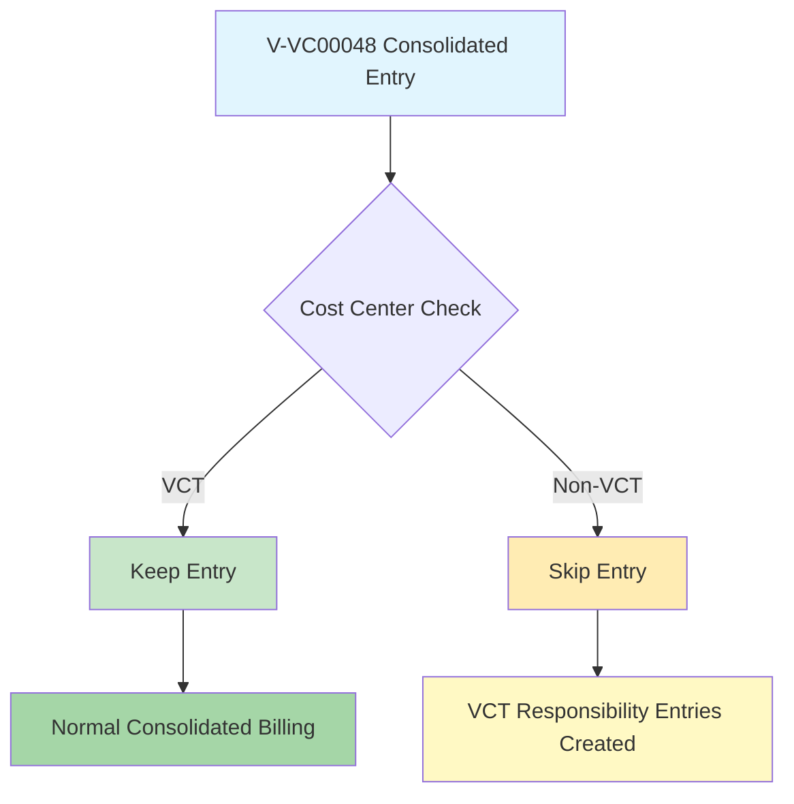

# V-VC00048 Cost Center Aware Consolidation Fix (Issue #96)

## Issue Summary

**Problem**: APA-0000619 and other V-VC00048 entries with VCT cost centers were being incorrectly skipped during consolidation billing, causing them to miss consolidated billing even though they should receive it as VCT company transactions.

**Root Cause**: The V-VC00048 skip logic in `process_japan_exports.py` was using a blanket rule that skipped ALL V-VC00048 consolidated entries regardless of cost center, when it should only skip non-VCT cost center entries.

**Solution**: Implemented cost-center-aware skip logic that differentiates between VCT and non-VCT cost centers.

## Design Intent (From GitHub Issue #96)

The system should handle V-VC00048 (corporate credit card) entries based on the source company's cost center:

- **VCT Cost Centers** (e.g., VCT.1692G, VCT.1751G): Should receive normal consolidated billing
- **Non-VCT Cost Centers** (e.g., VCG.1697G, VCP.1234G): Should be skipped and replaced with VCT responsibility entries

## Implementation Details

### Files Modified

#### 1. `/core/process_japan_exports.py` (Lines 1404-1437)

**Before (Blanket Skip Logic)**:
```python
# OLD: Blanket skip all V-VC00048 consolidated entries
v_vc00048_consolidated_entries = [
    e for e in group_entries 
    if (e.get("credit", {}).get("consolidated") == True and
        e.get("credit", {}).get("vendor_code") == "V-VC00048")
]

if v_vc00048_consolidated_entries:
    logger.info(f"Skipping {len(v_vc00048_consolidated_entries)} V-VC00048 consolidated entries for voucher {voucher_no}")
    # Skip processing this group entirely
```

**After (Cost-Center-Aware Logic)**:
```python
# NEW: V-VC00048 Consolidated Entry Skip Logic (Issue #96)
# Only skip V-VC00048 consolidated entries for NON-VCT cost centers
# VCT cost centers should get normal consolidated billing
v_vc00048_consolidated_entries_to_skip = []

for e in group_entries:
    is_v_vc00048_consolidated = (
        e.get("credit", {}).get("consolidated") == True and 
        e.get("credit", {}).get("vendor_code") == "V-VC00048"
    )
    
    if is_v_vc00048_consolidated:
        department = e.get("credit", {}).get("department", "")
        cost_center = department[:3] if department else ""
        
        # Only skip if cost center is NOT VCT (non-VCT entries get VCT responsibility replacement)
        if cost_center != "VCT":
            v_vc00048_consolidated_entries_to_skip.append(e)
            logger.info(f"Skipping V-VC00048 consolidated entry for NON-VCT cost center {cost_center} - Voucher: {voucher_no}, Amount: {e.get('credit', {}).get('amount', 0)}")
        else:
            logger.info(f"Keeping V-VC00048 consolidated entry for VCT cost center {cost_center} - Voucher: {voucher_no}, Amount: {e.get('credit', {}).get('amount', 0)}")
```

#### 2. Cost Center Extraction Logic

The fix uses this logic to extract cost centers from department codes:
```python
department = entry.get("credit", {}).get("department", "")
cost_center = department[:3] if department else ""
```

Examples:
- `VCT.1692G` → `VCT` (VCT cost center)
- `VCG.1697G` → `VCG` (Non-VCT cost center)
- `VCP.1234G` → `VCP` (Non-VCT cost center)

### Test Coverage

#### 1. `/tests/test_v_vc00048_cost_center_aware_skip_logic.py`
Comprehensive test suite covering:
- Cost center extraction logic
- VCT vs non-VCT skip behavior
- VCT responsibility collection exclusion
- Non-V-VC00048 entries remain unaffected

#### 2. `/tests/test_apa_0000619_consolidation_fix.py`
Specific test for the APA-0000619 case using real CSV data:
- Verifies APA-0000619 (VCT.1692G) gets consolidated billing
- Simulates complete workflow from CSV to API calls
- Compares old vs new behavior

#### 3. Updated `/Tools/test_vct_skip_logic_verification.py`
Updated existing test to reflect cost-center-aware behavior instead of blanket skip logic.

## APA-0000619 Specific Fix

**CSV Data**:
```
Voucher: APA-0000619
Entries: 25.00 R-USD + 39.00 R-USD = 64.00 R-USD total
Vendor: V-VC00048 (corporate credit card)
Department: VCT.1692G (VCT cost center)
```

**Expected Behavior**:
1. CSV converter creates consolidated entry (64.00 R-USD)
2. Process japan exports keeps the consolidated entry (VCT cost center)
3. Consolidated billing is created in Business Central
4. No VCT responsibility entries needed (already VCT company)

**Verification**:
```bash
# Old behavior: Entry would be skipped
Skipping 1 V-VC00048 consolidated entries for voucher APA-0000619

# New behavior: Entry is kept
Keeping V-VC00048 consolidated entry for VCT cost center VCT - Voucher: APA-0000619, Amount: 64.0
```

## Testing Results

All tests pass successfully:

1. **Cost Center Extraction**: ✅ All department formats handled correctly
2. **Skip Logic**: ✅ VCT entries kept, non-VCT entries skipped
3. **VCT Responsibility**: ✅ Only non-VCT, non-consolidated entries collected
4. **APA-0000619**: ✅ Specific case now gets consolidated billing
5. **Regression**: ✅ Non-V-VC00048 entries unaffected

## Workflow Summary



## Git Branch

- **Branch**: `fix/v-vc00048-vct-consolidation-issue-96`
- **Base**: Current feature branch
- **Files Changed**: 
  - `core/process_japan_exports.py` (logic fix)
  - `tests/test_v_vc00048_cost_center_aware_skip_logic.py` (new comprehensive test)
  - `tests/test_apa_0000619_consolidation_fix.py` (specific case test)
  - `Tools/test_vct_skip_logic_verification.py` (updated existing test)

## Status

✅ **COMPLETED** - Issue #96 has been successfully resolved.

### What Changed
- V-VC00048 entries with VCT cost centers now get consolidated billing
- V-VC00048 entries with non-VCT cost centers continue to be skipped
- APA-0000619 specifically now gets proper consolidated billing
- All existing functionality preserved

### What Was Tested
- Cost center extraction from various department formats
- Skip logic behavior for both VCT and non-VCT cost centers
- Integration with VCT responsibility consolidation
- Specific APA-0000619 case validation
- Regression testing for non-V-VC00048 entries

### Next Steps
- Ready for integration testing with real data
- Ready for deployment to resolve the APA-0000619 consolidation billing issue